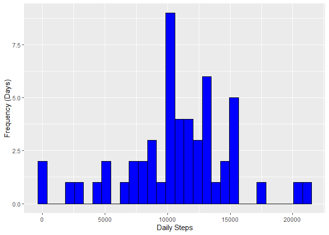
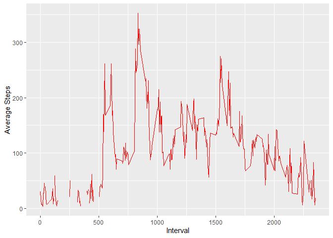
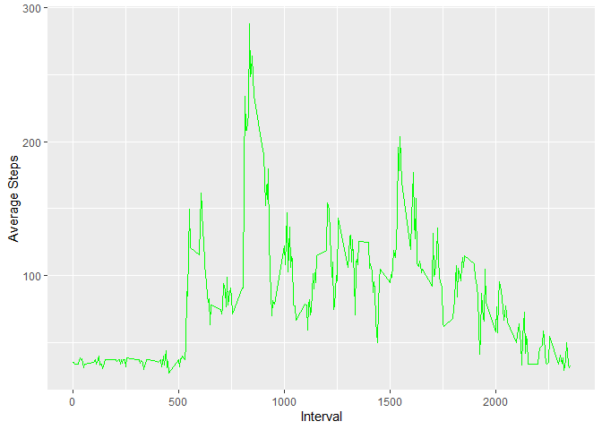
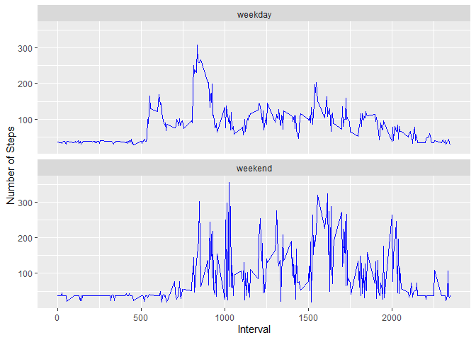

This script uses the following libraries

```r
library(data.table)
library(ggplot2)
```

## Loading and preprocessing the data
Load the data

```r
data<-read.csv("activity.csv")
data<-data.table(data)
```

## What is mean total number of steps taken per day?
Calculate the total number of steps taken per day

```r
daily_step_data=data[, .(daily_steps=sum(steps)), by= .(date)]
head(daily_step_data)
```

```
##          date daily_steps
## 1: 2012-10-01          NA
## 2: 2012-10-02         126
## 3: 2012-10-03       11352
## 4: 2012-10-04       12116
## 5: 2012-10-05       13294
## 6: 2012-10-06       15420
```
Make a histogram of the total number of steps taken each day

```r
ggplot(daily_step_data, aes(x=daily_steps))+
  geom_histogram( color = "black", fill="blue")+
  labs(x= "Daily Steps", y="Frequency (Days)")
```

<!-- -->

Calculate and report the mean and median of the total number of steps taken per day

```r
daily_step_summary=data[!is.na(steps), .(daily_steps_mean=mean(steps), daily_steps_median=median(steps[steps>0]))] 
daily_step_summary
```

```
##    daily_steps_mean daily_steps_median
## 1:          37.3826                 56
```

## What is the average daily activity pattern?
Make a time series plot of the 5-minute interval (x-axis) and the average number of steps taken, averaged across all days (y-axis)

```r
int_av=data[!is.na(steps), .(daily_steps_mean=mean(steps[steps>0])), by=.(interval)]
ggplot(int_av, aes(x=interval, y=daily_steps_mean))+
  geom_line(color="red")+
  labs(x="Interval", y="Average Steps")
```

<!-- -->

Which 5-minute interval, on average across all the days in the dataset, contains the maximum number of steps?

```r
int_av2=int_av[!is.na(daily_steps_mean),]
int_av2=int_av2[daily_steps_mean==max(int_av2$daily_steps_mean),]
int_av2
```

```
##    interval daily_steps_mean
## 1:      835         352.4839
```

## Imputing missing values
Calculate and report the total number of missing values in the dataset

```r
sum(apply(data, 1, anyNA))
```

```
## [1] 2304
```
Create a new dataset that is equal to the original dataset but with the missing data filled in.

```r
data2<-data[, steps := ifelse(is.na(steps), daily_step_summary$daily_steps_mean, steps)]
```
Make a histogram of the total number of steps taken each day and Calculate and report the mean and median total number of steps taken per day. 

```r
int_av2=data2[!is.na(steps), .(daily_steps_mean=mean(steps[steps>0])), by=.(interval)]
ggplot(int_av2, aes(x=interval, y=daily_steps_mean))+
  geom_line(color="green")+
  labs(x="Interval", y="Average Steps")
```

<!-- -->

```r
daily_step_data2=data2[, .(daily_steps=sum(steps)), by= .(date)]
daily_step_summary2=data2[!is.na(steps), .(daily_steps_mean=mean(steps), daily_steps_median=median(steps[steps>0]))] 
daily_step_summary2
```

```
##    daily_steps_mean daily_steps_median
## 1:          37.3826            37.3826
```
Do these values differ from the estimates from the first part of the assignment? What is the impact of imputing missing data on the estimates of the total daily number of steps?
### Daily step totals difference

```r
dst=daily_step_data2$daily_steps - daily_step_data$daily_steps
daily_step_data$dst_diff= dst
sum(daily_step_data$dst[daily_step_data$dst!=0])
```

```
## [1] NA
```
### Differences in means

```r
dsmean=daily_step_summary2$daily_steps_mean - daily_step_summary$daily_steps_mean
daily_step_summary$dsmean_diff= dsmean
sum(daily_step_summary$dsmean[daily_step_summary$dsmean!=0])
```

```
## [1] 0
```
### Difference in medians

```r
dsmedian=daily_step_summary2$daily_steps_median - daily_step_summary$daily_steps_median
daily_step_summary$dsmedian_diff= dsmedian
sum(daily_step_summary$dsmedian[daily_step_summary$dsmedian!=0])
```

```
## [1] -18.6174
```

## Are there differences in activity patterns between weekdays and weekends?
Create a new factor variable in the dataset with two levels – “weekday” and “weekend” indicating whether a given date is a weekday or weekend day.

```r
data3=data2[, .(day=weekdays(as.Date(date))), by=c("steps", "date", "interval")]
data3= data3[,day := ifelse((day == c("Saturday", "Sunday")), "weekend", "weekday")]
head(data3)
```

```
##      steps       date interval     day
## 1: 37.3826 2012-10-01        0 weekday
## 2: 37.3826 2012-10-01        5 weekday
## 3: 37.3826 2012-10-01       10 weekday
## 4: 37.3826 2012-10-01       15 weekday
## 5: 37.3826 2012-10-01       20 weekday
## 6: 37.3826 2012-10-01       25 weekday
```
Make a panel plot containing a time series plot of the 5-minute interval (x-axis) and the average number of steps taken, averaged across all weekday days or weekend days (y-axis). 

```r
int_weekend=data3[day=="weekend", .(steps_mean=mean(steps[steps>0])), by=.(interval, day)]
int_weekday=data3[day=="weekday", .(steps_mean=mean(steps[steps>0])), by=.(interval, day)]
int_day=rbind(int_weekend, int_weekday)

ggplot(int_day, aes(x=interval, y=steps_mean))+
  geom_line(color="blue")+
  labs(x="Interval", y="Number of Steps")+
  facet_wrap(.~day, ncol=1)
```

<!-- -->
